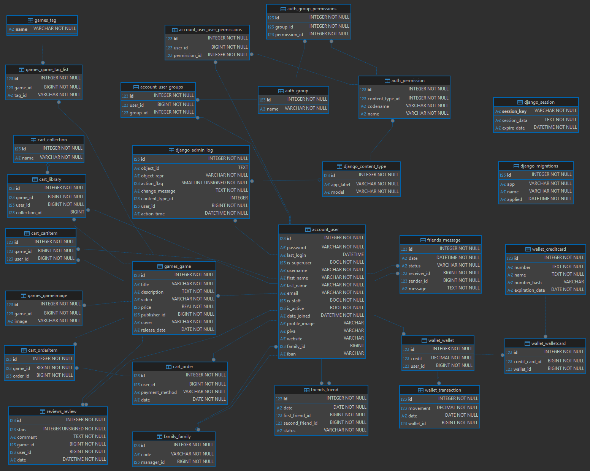

# VGShop - Next.js + Django Web Application

Questo è la repository principale del progetto **VGShop**, una piattaforma web e-commerce e community dedicata ai videogiochi.

L'applicazione è suddivisa in due componenti principali:

- **Frontend**: Sviluppato in **Next.js** (React 19, TypeScript, TailwindCSS, GSAP per animazioni avanzate e Three.js per elementi 3D).
- **Backend**: Sviluppato in **Django** (Django REST Framework per le API, Django Channels e Daphne per le connessioni WebSocket in tempo reale, database SQLite).

---

## Struttura della Repository

La struttura del progetto è organizzata come segue:

- [**VGShop Backend**](vgshop_backend)
- [**VGShop Frontend**](vgshop-frontend)

---

## Prerequisiti

Prima di procedere con l'installazione, è necessario avere installato sul dispositivo:

- **Node.js** (v24.0.0 o superiore consigliata)
- **Python** (v3.14 o superiore consigliata)
- Un gestore di pacchetti Node come **npm** (incluso con Node.js), **yarn**, o **pnpm**.
- Avere installato tramite **pip** il pacchetto **pipenv**

---

## Guida all'Installazione e Avvio

Per eseguire l'applicazione in locale, bisogna avviare separatamente il server Backend e il server Frontend, seguendo le istruzioni dettagliate nelle apposite sottocartelle.

---

## Funzionalità Principali del Progetto

Il sistema include diverse applicazioni integrate (app Django):

- Gestione utenti **customer** e **publisher**, registrazione, profili personali ed autenticazione tramite **JWT** salvato in cookie `HttpOnly` sicuri.
- Integrazione delle API esterne di **IGDB (Twitch)** utilizzato durante il seeding del database per recuperare dettagli, copertine e informazioni aggiornate.
- **Catalogo** dei videogiochi registrati nella piattaforma con possibilità di acquistarli.
- Gestione del **carrello** degli acquisti, aggiunta e rimozione di videogiochi dal carrello e possibilità di effettuare il checkout.
- **Portafoglio** virtuale associato all'utente per effettuare acquisti sul portale con logica di **ricarica/deposito**.
- Sistema di **recensioni** e **votazioni** da parte degli utenti per ciascun videogioco.
- Sistema **social** per inviare richieste di amicizia, accettarle e visualizzare la lista degli amici.
- Funzionalità di **gruppo familiare** per la condivisione o gestione dei contenuti.
- Algoritmo interno per suggerire giochi consigliati in base alle **preferenze** degli utenti.
- **Chat** in tempo reale integrata per la comunicazione istantanea tra amici o supporto utenti tramite **WebSocket**.

---

## Struttura database

Di seguito è mostrato lo schema ER del database utilizzato da VGShop:

**Nota:** per questioni semplificative ad ogni utente pre-esistente è stata assegnata la password `password123`, in modo da agevolare la fase di testing
